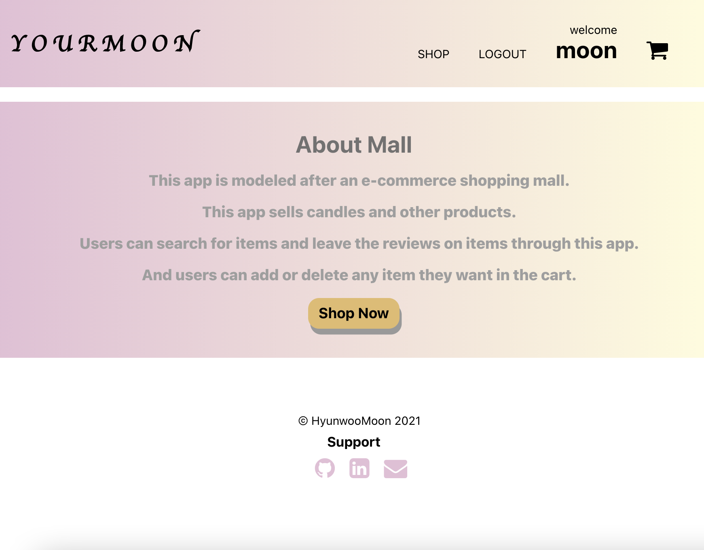
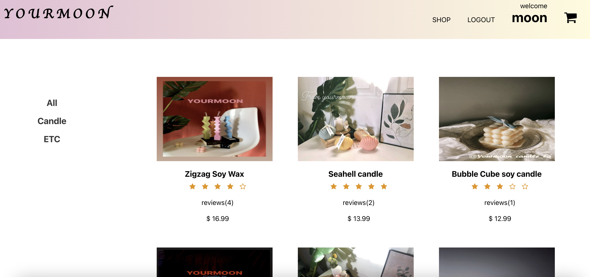
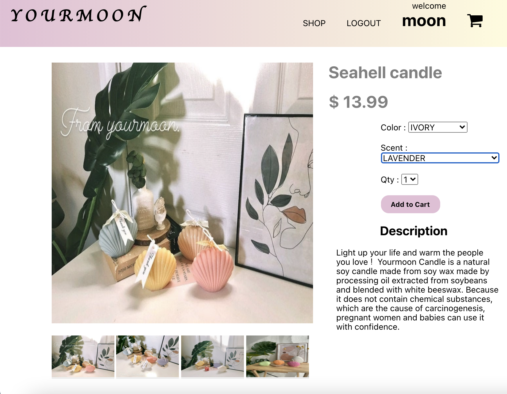
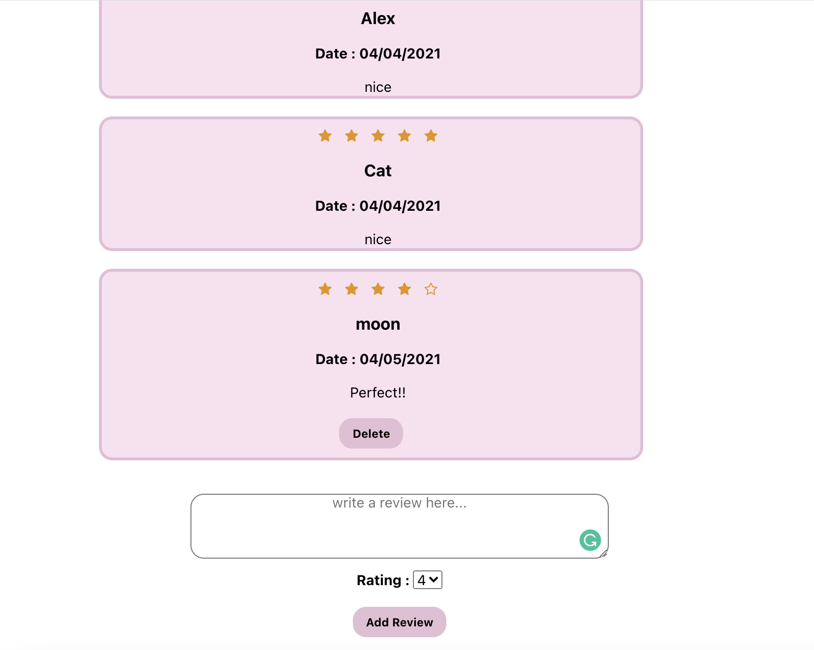
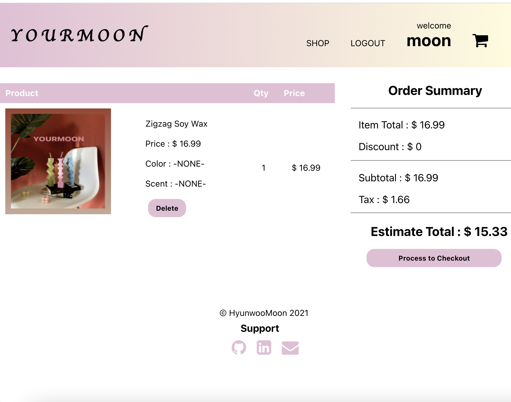

# YOURMOON

## Application Summary

- Users can register or login.
- Users can put the scent, color, and quantity in the cart.
- Users can add or delete their own review.

## Link

Live App : 
Server Repo : https://github.com/HyunwooMoon-developer/yourmoon-api.git

## What I use for App

- HTML, CSS

- REACT
   - Create React
   - React Router
   - React Context

- Testing
   - Jest (Smoke test)

- Production
   - Deployed via Vercel